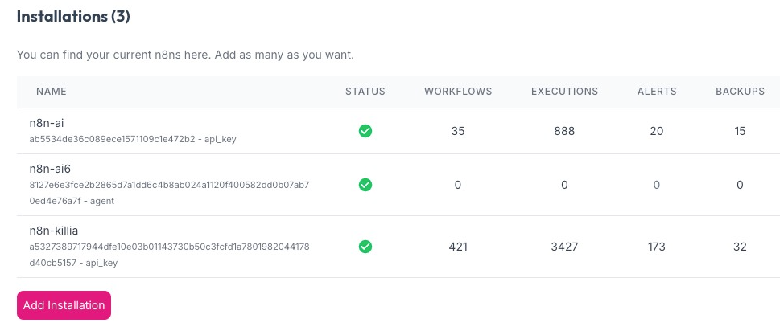
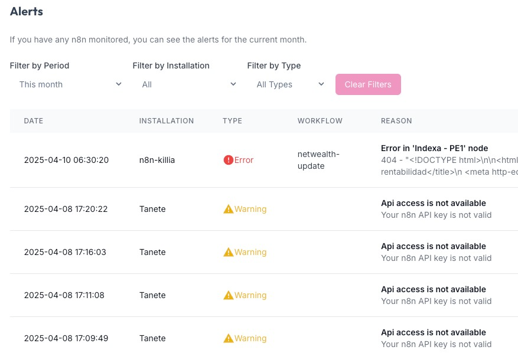
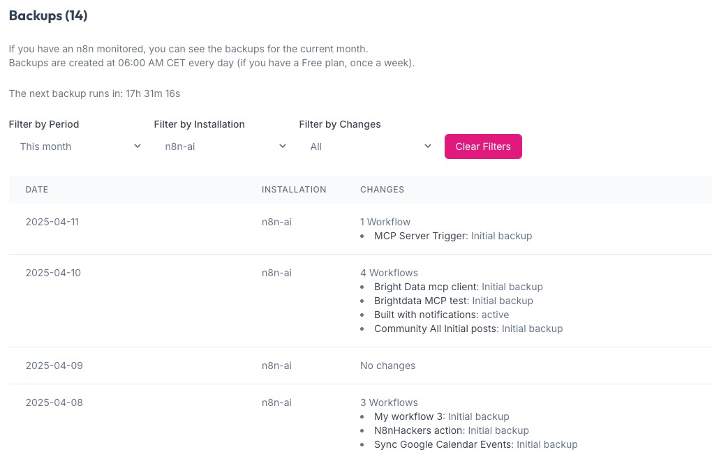
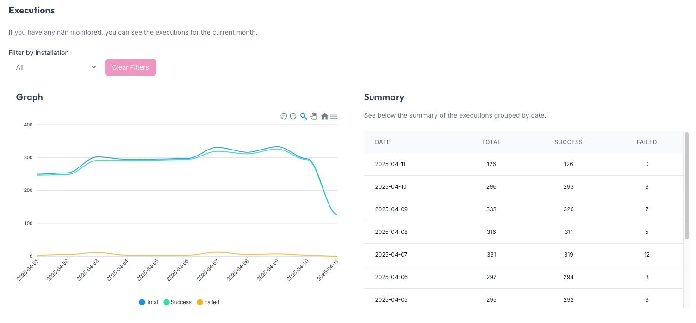
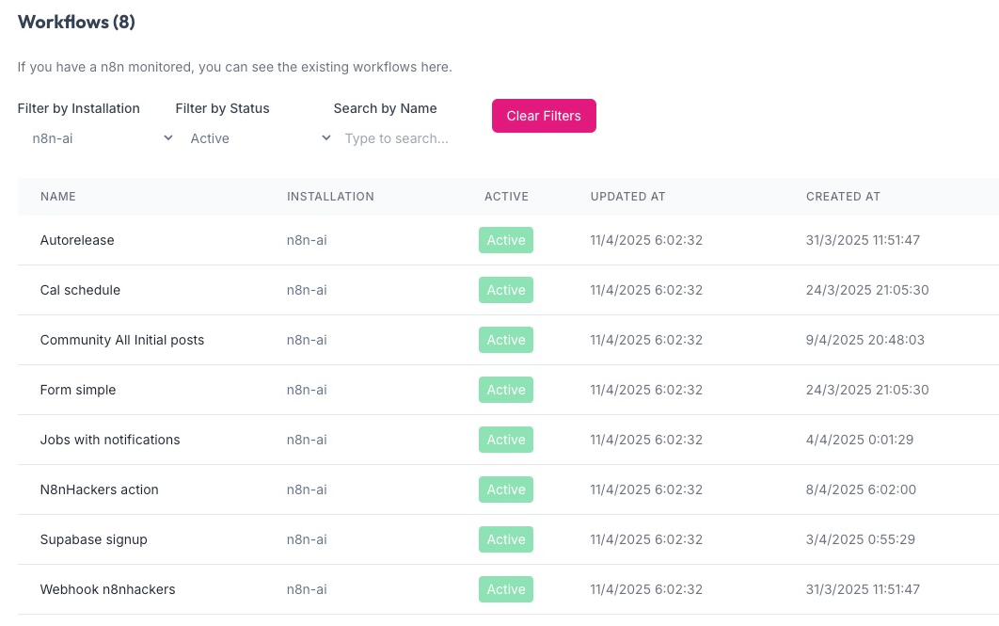
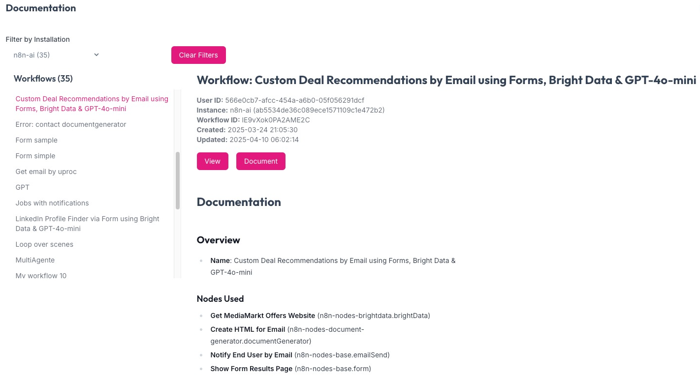

# Agent

The **n8nhackers Agent** is a powerful tool designed to enhance your n8n workflow management by providing advanced monitoring, alarms, and backup capabilities for up to 10 n8n instances. With this agent, you can:

- **Monitor up to 10 n8n instances**: Keep track of multiple n8n instances from a centralized interface.
- **Set up alarms for critical events**: Receive instant notifications for errors or anomalies in your workflows.
- **Automate workflow backups**: Ensure data safety with scheduled backups for all your workflows.
- **Track execution metrics**: Analyze workflow performance with detailed metrics like execution times and success rates.
- **Enhance operational reliability**: Proactively address issues with comprehensive monitoring and alerting features.
- **Push data securely**: Send data without exposing sensitive API keys.
- **Support for non-public n8n instances**: Ideal for setups where your n8n instances are not accessible from the public internet.

## TL;DR

To run the **n8nhackers Agent**, use the following Docker command:

```bash
docker run -d --name n8nhackers-agent \
-e N8NHACKERS_API_KEY=eyJhbGciOiJI... \
-e INSTANCE_NAME1=n8n1 \
-e INSTANCE_URL1=https://n8n1.mydomain.com \
-e INSTANCE_API_KEY1=eyJhbGciOiJI... \
n8nhackers/agent:latest
```

For detailed installation instructions, visit the [n8nhackers installations panel](https://n8nhackers.com/en/dashboard/resources/installations).
Check all the DockerHub images [here](https://hub.docker.com/repository/docker/n8nhackers/agent/general).

## Features

### Installations

Add as many n8ns you want to monitor. Use our dashboard to control multiple n8ns.



### Monitoring and Alarms
The agent provides real-time monitoring and alarm notifications for critical events, ensuring your workflows run smoothly.



### Workflow Backups
Automate your workflow backups to prevent data loss and maintain operational continuity.




### Execution Metrics
Track and analyze execution metrics to optimize workflow performance.



### Workflows

Manage and organize your workflows efficiently with the agent's intuitive interface. Easily monitor, edit, and optimize workflows to ensure seamless operations.




### Workflows Documentation

Access comprehensive documentation for managing your workflows. The agent allows you to query existing workflow documentation automatically, enabling you to create, edit, and optimize workflows effectively using its advanced features.



## Change Log

### [1.0.1] - New capabilities
- Organize code
- Change parsing of instances
- Recover pending jobs
- Add metrics

### [1.0.0] - Initial Release
- Added monitoring support for up to 10 n8n instances.
- Introduced alarm notifications for critical events.
- Enabled automated workflow backup functionality.
- Implemented secure data handling without sharing API keys.
- Optimized for non-publicly exposed n8n instances.

## Contact

For support or inquiries, please contact us at [support@n8nhackers.com](mailto:support@n8nhackers.com).
